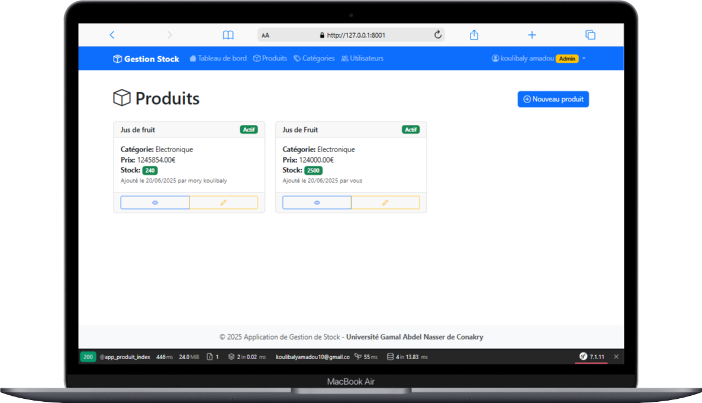
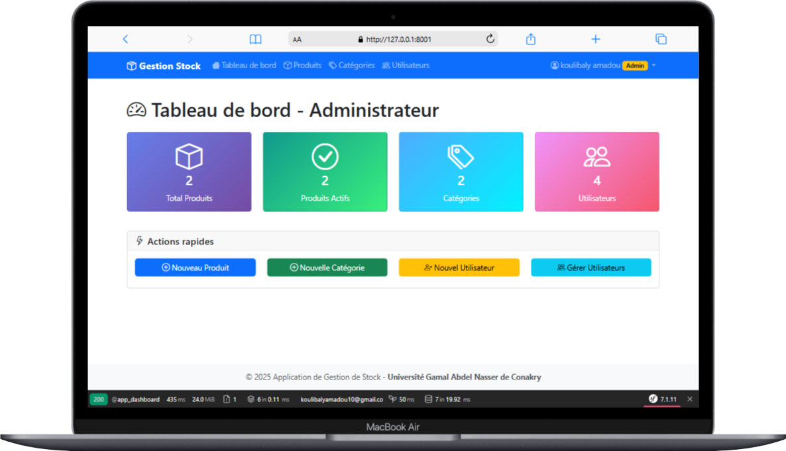
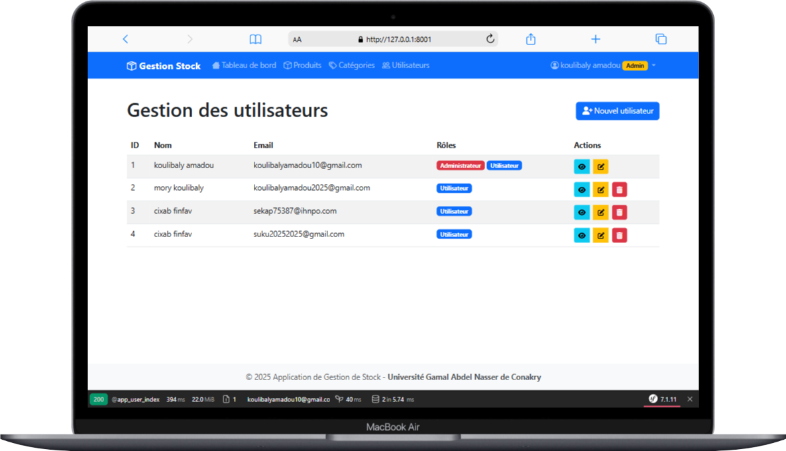

# 📦 Application de Gestion de Stock

## 🖼️ Images illustratives

### Image 1


### Image 2


### Image 3


---

**Projet académique** réalisé dans le cadre de la Licence 3 à l’Université Gamal Abdel Nasser de Conakry (UGANC), Faculté du Centre Informatique.

- **Technologie principale** : Symfony 7  
- **Durée estimée** : 2 à 3 jours  
- **Auteur** : Koulibaly Amadou  
- **Encadrement** : UGANC - Centre Informatique

---

## 🎯 Objectif du projet

Développer une application web intuitive et sécurisée permettant :
- Aux **utilisateurs simples** de consulter les produits disponibles.
- Aux **administrateurs** de gérer les produits, les catégories et les utilisateurs via une interface dédiée.
- De **restreindre l’accès** à l’application via un **abonnement mensuel obligatoire de 50 000 GNF**, payable via **Lengo Pay**.
- D’envoyer des **notifications par e-mail** lors de certains événements.

---

## 🧩 Description Générale

Deux types d'utilisateurs :
- **Administrateur (`ROLE_ADMIN`)** : gestion complète des produits, catégories et utilisateurs.
- **Utilisateur (`ROLE_USER`)** : accès uniquement aux produits actifs (sous réserve d’abonnement valide).

Accès contrôlé par abonnement, architecture MVC, design responsive, logique métier bien séparée.

---

## 🚀 Fonctionnalités principales

### 🔐 Authentification & Rôles
- Inscription / Connexion
- Protection des routes selon les rôles (`ROLE_USER`, `ROLE_ADMIN`)

### 📦 Gestion des entités (CRUD)
- **Produits** : CRUD complet (admin)
- **Catégories** : CRUD complet (admin)
- **Utilisateurs** : CRUD partiel (admin ou EasyAdmin)

### 🔁 Relations entre entités
- Produit → Catégorie : `ManyToOne`
- Catégorie → Produits : `OneToMany`

### 🧠 Logique métier
- Réduction automatique du stock lors d’une vente
- Désactivation du produit si stock = 0

### 🎯 Affichage conditionnel
- Produits actifs uniquement pour les utilisateurs
- Interface dynamique selon le rôle

### 👤 Données personnalisées
- Tableau de bord personnalisé par utilisateur
- Historique de produits ajoutés

### 📅 Abonnement mensuel obligatoire (via Lengo Pay)
- L’utilisateur doit payer 50 000 GNF/mois avant d’accéder aux fonctionnalités.
- Paiement sécurisé via l’API de **Lengo Pay**.
- Redirection automatique vers la page de paiement si l’abonnement est expiré ou inexistant.
- Callback automatique pour activer l’abonnement à la réception du paiement.

### 📧 Envoi d’e-mails
- Confirmation d’inscription
- Notification de fin d’abonnement
- Réception des alertes d’inventaire bas (optionnelle)

### ✅ Bonnes pratiques
- Séparation stricte logique / présentation
- Utilisation des services Symfony
- Validation des formulaires
- Flash messages pour le feedback utilisateur

---

## 🗂️ Entités principales

| Entité      | Champs principaux                                                  |
|-------------|--------------------------------------------------------------------|
| Utilisateur | nom, email, mot de passe, rôle                                     |
| Catégorie   | id, nom, description                                               |
| Produit     | id, nom, prix, quantité, actif (bool), date_ajout, catégorie       |
| Abonnement  | user_id, date_debut, date_fin, estActif                            |

---

## 🔗 Intégration de Lengo Pay

### ✅ Endpoint

```http
POST https://portal.lengopay.com/api/v1/payments

### Installation & Exécution
1. Cloner le projet
git clone https://github.com/koulibalyamadou10/symfony_stock_manager
cd symfony_stock_manager

2. Installer les dépendances
composer install

3. lancer les migrations
php bin/console doctrine:database:create
php bin/console doctrine:migrations:migrate
